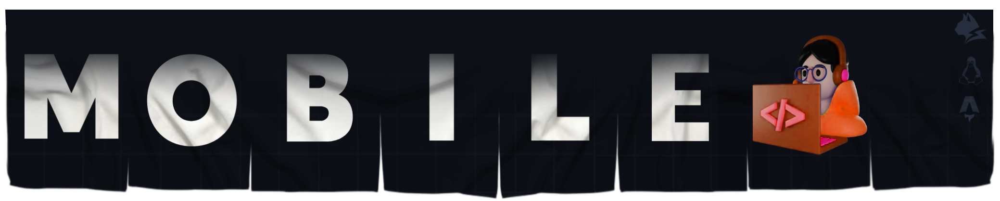

<!-- Top [Presentation] -->


<!-- Flag US/CN -->
<table align="right">
  <tr>
    <td>
       English
    </td>
  </tr>
  <tr>
    <td>
      <span>­­ </span>
      <a href="https://github.com/bastndev">
         Chinese
      </a>
    </td>
  </tr>
</table>

<!-- About ME -->

## About [ME](https://www.bastndev.com)

```py
  Hello 👋 welcome to my profile...
```

```rs
class 🧑‍💻 {
  nickname  = 'bastndev';
  skills    = ['LynxJS', 'Flutter', 'AstroJS', 'React','Supabase'];
  interests = ['Linux', 'Mobile', 'FrontEnd', 'UI/UX', 'AI'];
  work      = 'Microsoft';
  From      = 'Peru 🇵🇪';
  os        = 'Debian';
  contact() {
    return 'gobasdev@gmail.com';
  }
}
```

<!-- Youtube chanel -->

## 🔴 Latest videos [Youtube](https://youtube.com/bastndev?sub_confirmation=1)

<!-- YOUTUBE-CARDS:START -->

    <a href="https://www.youtube.com/watch?v=SNN2cU8zOEQ">
      
      <br>
      <strong>La GUÍA de Linux: Comandos, Apps, Paquetes y Websites que deberías conocer y usar ¡YA!! 2025</strong>
      <br>
      <span>⏱️ 42:38</span>
    </a>
    <br><br>
    <a href="https://www.youtube.com/watch?v=GmItICIcX6g">
      
      <br>
      <strong>Paquetes Flatpak vs. Snap vs. .DEB vs. RPM 🚀 ¿Cuál es el Mejor en 2025?</strong>
      <br>
      <span>⏱️ 7:57</span>
    </a>
    <br><br>
    <a href="https://www.youtube.com/watch?v=JxN7_dceS94">
      
      <br>
      <strong>Mejores Herramientas para Linux 🐧 2025 | Alternativas Potentes a Software de Windows</strong>
      <br>
      <span>⏱️ 20:22</span>
    </a>
    <br><br>
<!-- YOUTUBE-CARDS:END -->

<!-- Vscode extensions -->

## 🔵 VScode [Extensions](https://open-vsx.org/namespace/bastndev)

<table align="center" width="100%" style="table-layout: fixed">
  <tr align="center">
    <td>
      <a href="https://marketplace.visualstudio.com/items?itemName=bastndev.lynx-theme" target="_blank" rel="noreferrer">
        
      </a>
    </td>
    <td width="111px">
      <a href="https://marketplace.visualstudio.com/items?itemName=bastndev.lynx-keymap" target="_blank" rel="noreferrer">
        
      </a>
    </td>
    <td>
      <a href="https://marketplace.visualstudio.com/items?itemName=bastndev.lynx-js-snippets" target="_blank" rel="noreferrer">
        
      </a>
    </td>
    <td>
      <a href="https://marketplace.visualstudio.com/items?itemName=bastndev.lynxjs-pack" target="_blank" rel="noreferrer">
        
      </a>
    </td>
    <td>
      <a href="https://marketplace.visualstudio.com/items?itemName=bastndev.bracket-lynx" target="_blank" rel="noreferrer">
        
      </a>
    </td>
    <td>
      <a href="https://marketplace.visualstudio.com/publishers/bastndev" target="_blank" rel="noreferrer">
        
      </a>
    </td>
  </tr>
  <tr align="center">
    <th><a href="https://github.com/bastndev/Lynx-Theme">Theme</a></th>
    <th><a href="https://github.com/bastndev/Lynx-Keymap">Keymap</a></th>
    <th><a href="https://github.com/bastndev/Lynx-js-Snippets">Snippets</a></th>
    <th><a href="https://github.com/bastndev/LynxJs-Packge">Package</a></th>
    <th><a href="https://github.com/bastndev/Bracket-Lynx">Bracket</a></th>
    <th>MORE</th>
  </tr>
</table>

</br>

<!-- Visor counter  -->
  <p align="center" style="display: flex; align-items: center; gap: 10px;">
    <a href="https://codepen.io/bastndev" rel="noopener noreferrer">
      
    </a>
  </p>
