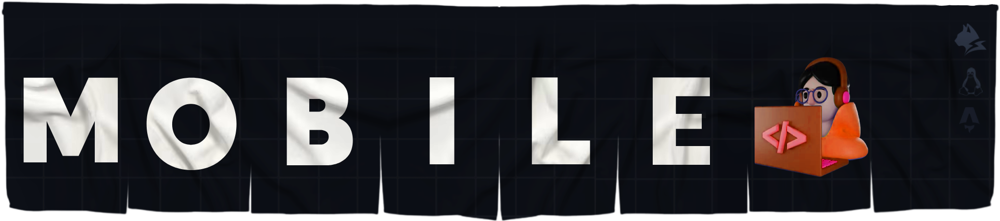

<!-- Top [Presentation] -->


<!-- Flag US/CN -->
<table align="right">
  <tr>
    <td>
       English
    </td>
  </tr>
  <tr>
    <td>
      <span>­­ </span>
      <a href="https://github.com/bastndev">
         Chinese
      </a>
    </td>
  </tr>
</table>

<!-- About ME -->
<h2>
  About me
  
</h2>

```ts
class 👤 {
  nickname  = 'bastndev';
  education = 'autodidact';
  research  = ['FrontEnd', 'Mobile', 'AI', 'Cyber Security'];
  interests = ['Reading', 'Coding', 'UI', 'AI'];
  skills    = ['TypeScript', 'JavaScript', 'Tailwind', 'Node.js', 'Dart'];
  work      = 'Microsoft';

  contact() {
    return 'gobasdev@gmail.com';
  }
}
```

<!-- Vscode extensions -->

## ⚪️ VScode Extensions ㅤㅤㅤ

<table align="center" width="100%" style="table-layout: fixed">
  <tr align="center">
    <td>
      <a href="https://marketplace.visualstudio.com/items?itemName=bastndev.lynx-theme" target="_blank" rel="noreferrer">
        
      </a>
    </td>
    <td width="111px">
      <a href="https://marketplace.visualstudio.com/items?itemName=bastndev.lynx-keymap" target="_blank" rel="noreferrer">
        
      </a>
    </td>
    <td>
      <a href="https://marketplace.visualstudio.com/items?itemName=bastndev.lynx-js-snippets" target="_blank" rel="noreferrer">
        
      </a>
    </td>
    <td>
      <a href="https://marketplace.visualstudio.com/items?itemName=bastndev.lynxjs-pack" target="_blank" rel="noreferrer">
        
      </a>
    </td>
        <td>
      <a href="https://marketplace.visualstudio.com/publishers/bastndev" target="_blank" rel="noreferrer">
        
      </a>
    </td>
  </tr>
  <tr align="center">
    <th><a href="https://github.com/bastndev/Lynx-Theme">Theme</a></th>
    <th><a href="https://github.com/bastndev/Lynx-Keymap">Keymap</a></th>
    <th><a href="https://github.com/bastndev/Lynx-js-Snippets">Snippets</a></th>
    <th><a href="https://github.com/bastndev/LynxJs-Packge">Package</a></th>
    <th>MORE</th>
  </tr>
</table>

</br>

<!-- Visor counter  -->
  <p align="center" style="display: flex; align-items: center; gap: 10px;">
    <a href="https://codepen.io/bastndev" rel="noopener noreferrer">
      
    </a>
  </p>
