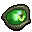

<!-- code IMG -->

 

<!-- ABOUT ME -->

<b>ABOUT ME</b> 

  
  
    <h6>
      Hey, I'm <a href="https://www.linkedin.com/in/bastndev/">Gohit bastian </a>and I'm from Peru 🇵🇪. Currently, I'm working<a href="https://www.bastndev.com/"> @bastndev </a>. In my personal projects. I'm interested in developing applications that have integrated artificial intelligence. If you want me to be part of your team, you can 
    </h6>
</pre>
  <h3 align="center">
<kbd>
  ➥ <a href="https://www.linkedin.com/in/bastndev/" > My interests: </a> • Artificial Intelligence | • Mobile Development | • UI/UX
  </h5>
</kbd>

<!-- STATISTICS graph -->

<!-- STATISTICS -->

<b>𝚜𝚝𝚊𝚝𝚒𝚜𝚝𝚒𝚌𝚜</b> 

 

ee

<!-- Visit Counter -->

 

