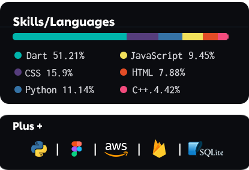

<!-- TODO: code IMG -->

 

<!-- TODO: ABOUT ME -->

<b>ABOUT ME </b> 

  
  
    <h6>
      Hey, I'm <a href="https://www.linkedin.com/in/bastndev/">Gohit bastian </a>from Peru 🇵🇪. Currently, I work on developing applications with (Dart) & (Flutter) integrating artificial intelligence (AI) into my personal projects. You can see my projects at <a href="https://www.bastndev.com/">@bastndev</a> if you want me to be part of your team, send me an. 
    </h6>
<h3 align="center">
  <kbd>
  ➥ <b>My interests:</b> • Artificial Intelligence | • Mobile Development | • UI/UX
  </kbd>
</h3>

<!-- TODO: STATISTICS graph -->

<!-- TODO: STATISTICS -->

<b>𝚜𝚝𝚊𝚝𝚒𝚜𝚝𝚒𝚌𝚜</b> 
 

  
  

   

<!-- Start -->

 

<!-- TODO: Links Social Media -->

 

<!-- TODO: Visit View -->

